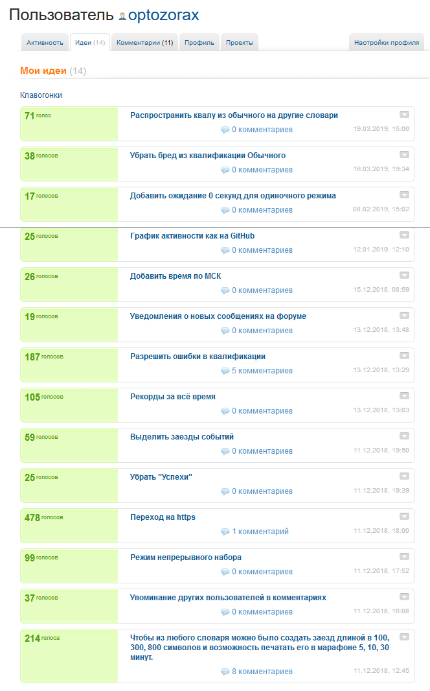
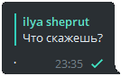
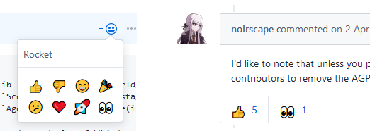

# Введение

У меня постоянно возникают идеи для всяких приложений, сайтов. И я их записываю. Здесь будет сборник того, что не стыдно опубликовать в интернет. Эта страница будет переодически дополняться при появлении новых идей. Надеюсь она вдохновит вас.

Так же я считаю что вместо критики можно высказывать идеи по улучшению, это во-первых более позитивно, а во-вторых, более конструктивно.

# Немного наблюдений насчет идей

* Лучший способ придумать новые идеи для продукта - пользоваться им ежедневно.
* Идеи приходят намного охотней когда имеется возможность их куда-то записать, где они будут оценены.

## Сайт для идей

У меня есть мечта - чтобы существовал сайт, где можно разным сервисам предлагать собственные идеи, лайкать и дизлайкать чужие, комментировать их. 

Вот мое видение этого сайта:

* Можно создать раздел предложения идей для любого сайта, приложения, даже для такой глобальной темы как школьное образование. Разделы создают пользователи, затем модераторы их объединяют, если созданы дубликаты, а истинные владельцы, если им это необходимо, подтверждают официальную страницу, которую они обещают мониторить.
* На каждый такой раздел можно подписаться, чтобы в ленте появлялись идеи к этим сервисам.
* Лента работает по принципу стека с возможностью снять с любого уровня: вверх ленты добавляются новые идеи, но после того, как ты её оценил, либо отметил как прочитанную, она исчезает из ленты. Так же есть возможность посмотреть все идеи, которые ты оценил, лайкнул, дизлайкнул, и посмотреть непросмотренные для данного раздела.
* У каждой идеи можно ставить под-идеи, и пользователи за них будут голосовать отдельно внутри.

Так же суть этого сайта будет не только в предложении идей, но и доведении их до совершенства. Ведь один человек видит идею только со своей колокольни, а другой может предложить как её дополнить, чтобы и ему было удобно.

Ну и конечно, на этом сайте должен быть раздел для предложения идей для него же. Это в первую очередь, потому что если сам сайт для идей не может улучшаться под предлогом идей, то почему другие должны?

Честно признаюсь, истоки идеи об этом сайте исходят отсюда: [WMmail.ru](https://web.archive.org/web/20190523155023/http://wmmail.ru/index.php?cf=idea-viewallidea&type=30&i_search=0&i_name=&itype=-1&iuid=0).

## Идеи для клавогонок

Я ещё больше убедился, что я хочу сайт для идей когда на Клавогонках неожиданно появился раздел для предложения идей: [http://klavogonki.reformal.ru/proj/?mod=one](https://web.archive.org/web/20190610122840/http://klavogonki.reformal.ru/proj/?mod=one). Я сразу же написал очень много идей, что до этого были лишь в мыслях. 

Потом по мере пользования клавогонками приходило ещё много классных идей. *И вообще они приходили намного охотней именно когда появилась возможность их куда-то написать.* Вот тут можно посмотреть мои идеи: [http://reformal.ru/users/1311323-optozorax/?what=idea](https://web.archive.org/save/http://reformal.ru/users/1311323-optozorax/?what=idea).



<hr>

# Идеи для Telegram

* **Папки для диалогов.**
	* Количество папок не ограничено. Им можно давать свои имена и задавать возможность получения уведомлений из них.
	* Можно задать папку, куда будут автоматически добавляться все новые диалоги и контакты. Это будет очень полезно для популярных людей, чтобы они не теряли свои диалоги среди миллионов сообщений от фанатов.
	* Я бы создал следующие папки:
		* Частые диалоги
		* Редкие диалоги
		* Каналы
		* Чаты
		* Потраченные диалоги
	* Конечно, можно сказать, что в телеге появилась возможность добавлять диалоги в архив. Да, согласен, это круто, но этого недостаточно. 
	* Деловые люди могут разделять диалоги на: Работа/Личная жизнь.
* **Более обширное избранное для стикеров.**
	* Сейчас в избранное можно добавить лишь 5 стикеров.
	* Нужно, чтобы количество стикеров там было не ограничено.
	* Чтобы была возможность раскидывать избранные стикеры по папкам, и внутри папок двигать и перемещать как угодно.
	* Чтобы при использовании стикера, другой человек, нажимая на него, мог либо получить доступ к твоему избранному, либо к оригинальному паку данного стикера. (Как ты захочешь в настройках.)
	* Пока что эту проблему можно частично решить с помощью [@stckrRobot](t.me/@stckrRobot).
* **Повтор сообщения.**
	* Очень часто я при общении с друзьями напоминаю о своем сообщении с помощью точки:
	
	* Лично я это делаю настолько часто, что считаю нужным ввести целую дополнительную функцию для повтора сообщения.
	* И желательно, чтобы этот повтор можно было делать как ответ на сообщение собеседника. А то он часто задает вопрос, а не замечает, что ему ответили на это выше.
* **Реакция на сообщения с помощью эмодзи.**
	* Очень часто бывает так, что мы отвечаем так: `++++++++++++++`. Вместо того, чтобы плодить целое сообщение, можно было бы добавить возможность ставить этот плюсик в виде зелёной эмодзи на сообщении. Пример того, где это уже есть: github, instagram.
	
	* Пример эмодзи, которые можно использовать как маркер на сообщении:
		* Сердечко
		* Плюсик
		* Глаза (типо посмотрел видео или статью что тебе кинул друг)
		* Лайк, дизлайк.
	* Проблема в отслеживании установки этих эмодзи. Для поддержки отслеживания их, надо в диалоге добавить отдельную секцию, где можно посмотреть хронологический порядок, и перейти к сообщению, на которое поставили это эмодзи. Так же надо ставить в настройках отдельную галочку типо присылать ли уведомления о них или нет - ещё одна головная боль.
	* Так же я думаю следует разрешить любые эмодзи ставить, но самые часты ставить вверху.
* **Поиск стикеров по ключевым словам.**
	* Есть стикеры с Дружко, и куча мемных стикеров, в которых слова важнее, чем изображение. Хотелось бы искать их по словам, как сейчас ищутся эмодзи по словам, даже самым необычным 🤬.
	* Честно я не представляю как это будет работать, возможно авторы сами будут добавлять эти фразы, и это будет на их совести, возможно пользователи будут обучать алгоритмы и предлагать свои варианты наименования стикеров.

<hr>

# Идеи для YouTube

```c++
// TODO
```

<hr>

# Идеи для Twitter

```c++
// TODO
```